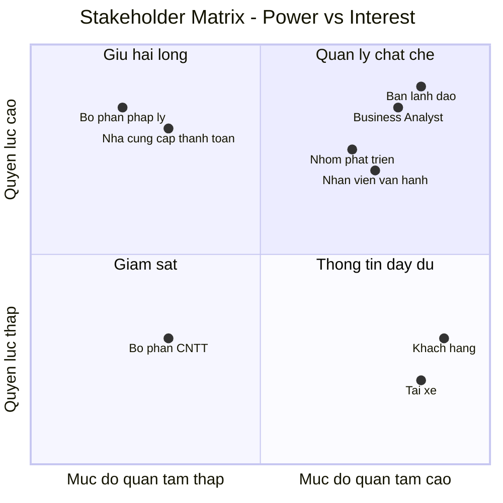
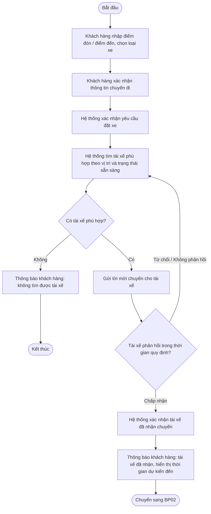
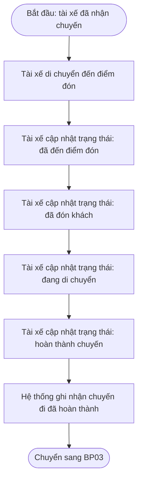
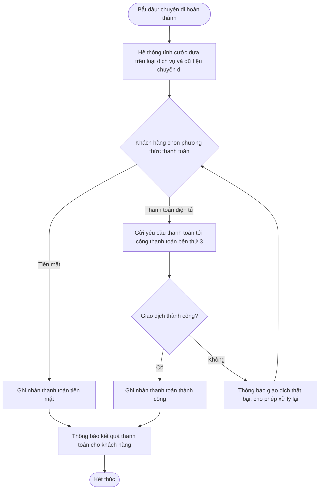
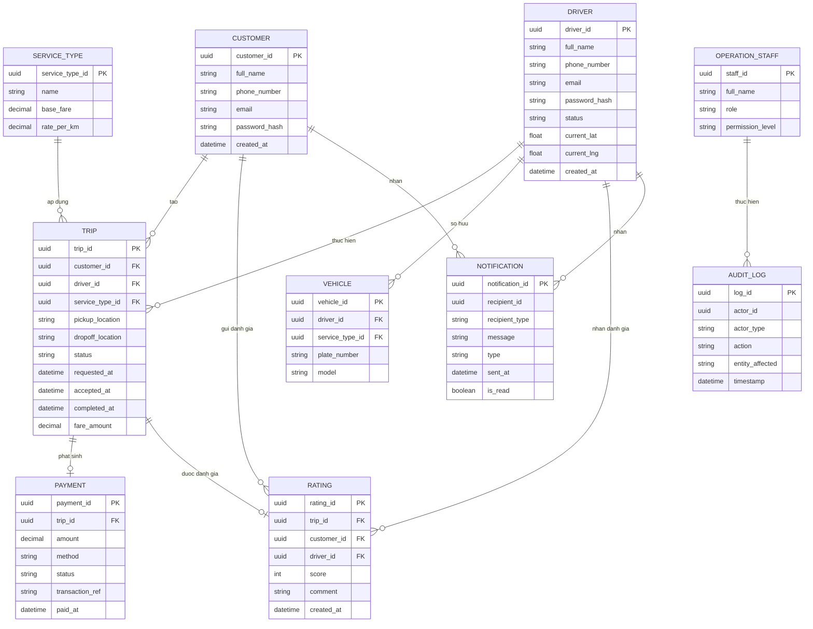
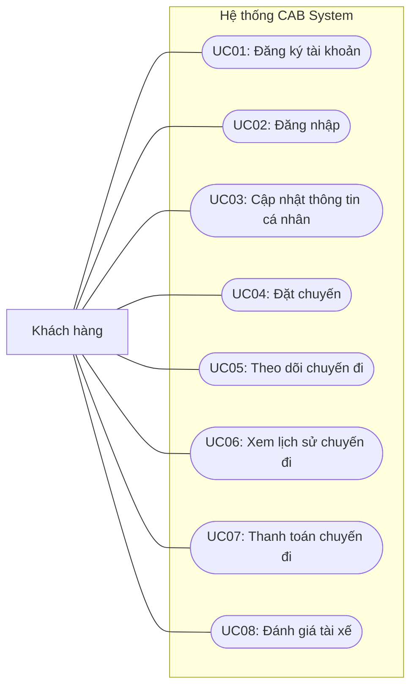
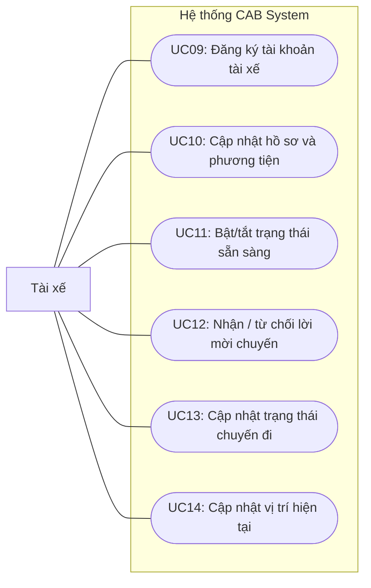
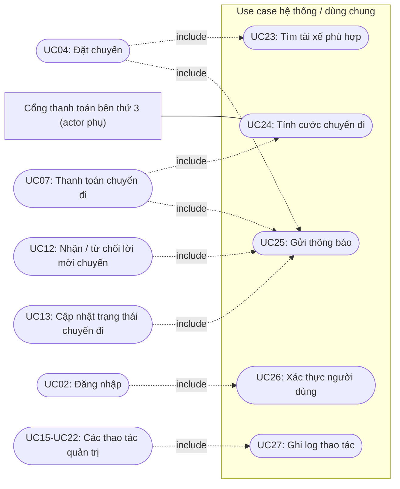

## Bước 1: Đọc và phân tích yêu cầu của khách hàng ở giai đoạn sơ khởi ở giai đoạn 1 business context,problem
## bước 2: xác định những stakeholders (lọc ra bảng gồm 2 cột, cột thứ nhất gồm tên stakeholders, cột thứ 2 là vai trò của nó) phần 2 là vẽ ma trận stakeholder matrix (ma trận này sẽ cho chúng ta biết tầm ảnh hưởng quan trọng của stakeholders trong hệ thống - dùng công cụ mermaid để vẽ các sơ đồ trong markdown)
## Bước 3:  xác định business, mục tiêu nghiệp vụ ,thiết kế business goal hay tên gọi là gì tôi nghe không rõ (bg01 là gì bg02 là gì) hệ thống có chức năng tự động tìm tài xế , Ví dụ lấy 1 cái như bg02 là cho phép thanh toán bằng tiền mặt hoặc trực tuyến .
## bước4: xác định các phạm vi (ví dụ quản lý khách hàng, quản lí tài xế, liệt kê ra những cái yêu cầu mà phải làm, xác định dc các module cơ bản cho hệ thống dưới góc độ phần mềm bản MVB). Những cái ngoài phạm vi tôi không nên làm
## bước 5 xác nhận yêu cầu như thiết kế chuyển những yêu cầu đó Business requirement , mỗi requirement ký hiệu là BR (br01,br02)),như br01 là đặt chuyến , thiết kế diễn giải ,tạo bảng 3 cột ,Mã,tên, diễn giải
## bước 6: xây dựng các Business process ví dụ như đặt chuyến:"tạo chuyến đi,xác nhân điểm đón/đến,hệ thống xác nhận, tìm tài xế,đợi tài xế nhận chuyến "
## bước 7: sau khi có được những cái nhìn đầu tiên từ BR , thiết kế FR phân rã các BR
# Software Requirements Specification (SRS)
## Dự án: CAB System – Nền tảng đặt xe

**Khách hàng:** Công ty ABC
**Thời gian triển khai:** 7 tuần
**Người soạn thảo:** [Tên Business Analyst]
**Ngày:** [dd/mm/yyyy]
**Phiên bản:** 0.1 (Sơ khởi – Draft)

---

## 1. Giới thiệu

### 1.1 Mục đích
Tài liệu này mô tả các yêu cầu sơ khởi cho hệ thống CAB System — nền tảng đặt xe trực tuyến mới của Công ty ABC, thay thế hệ thống tổng đài/app hiện tại còn nhiều hạn chế về phân công tài xế, theo dõi chuyến đi, quản lý thanh toán và khả năng mở rộng.

### 1.2 Phạm vi
Hệ thống phục vụ 3 nhóm người dùng chính: **Khách hàng**, **Tài xế**, **Nhân viên vận hành**. Phạm vi bao gồm toàn bộ quy trình: tạo yêu cầu đặt xe → tìm và phân công tài xế → thực hiện chuyến → tính cước → thanh toán → thông báo → đánh giá sau chuyến.

### 1.3 Đối tượng đọc tài liệu
Nhóm phát triển, khách hàng (Công ty ABC), các bên liên quan tham gia dự án.

---

## 2. Mô tả tổng quan

### 2.1 Bối cảnh nghiệp vụ
Công ty ABC hiện cung cấp dịch vụ đặt xe qua tổng đài hoặc ứng dụng đơn giản. Hệ thống hiện tại có các hạn chế:
- Phân công tài xế chủ yếu thủ công.
- Khách hàng khó theo dõi trạng thái chuyến đi.
- Thông tin thanh toán chưa được quản lý tập trung.
- Khó mở rộng khi tải tăng hoặc cần thêm tính năng.

### 2.2 Mục tiêu hệ thống mới
- Phục vụ số lượng lớn khách hàng và tài xế đồng thời.
- Tự động hóa việc tìm và phân công tài xế.
- Cho phép mở rộng thêm tính năng trong tương lai mà không cần xây lại toàn bộ hệ thống.

### 2.3 Tác nhân (Actors)
| Tác nhân | Mô tả |
|---|---|
| Khách hàng | Người sử dụng dịch vụ đặt xe |
| Tài xế | Người thực hiện chuyến đi |
| Nhân viên vận hành | Quản trị và giám sát hệ thống |
| Cổng thanh toán bên thứ 3 | Hệ thống ngoài xử lý giao dịch điện tử |

---

## 3. Yêu cầu chức năng (Functional Requirements)

### 3.1 Khách hàng
- FR-01: Đăng ký tài khoản, đăng nhập.
- FR-02: Cập nhật thông tin cá nhân.
- FR-03: Nhập điểm đón, điểm đến và chọn loại xe.
- FR-04: Gửi yêu cầu đặt xe.
- FR-05: Theo dõi trạng thái chuyến đi (đang tìm tài xế, tài xế đã nhận, ETA, đang di chuyển, hoàn thành).
- FR-06: Xem lịch sử chuyến đi và số tiền đã thanh toán.
- FR-07: Đánh giá tài xế sau khi hoàn thành chuyến.

### 3.2 Tài xế
- FR-08: Đăng ký tài khoản hoặc được nhân viên vận hành tạo tài khoản.
- FR-09: Cập nhật hồ sơ cá nhân và thông tin phương tiện.
- FR-10: Chuyển đổi trạng thái sẵn sàng nhận chuyến.
- FR-11: Nhận thông báo khi có yêu cầu chuyến phù hợp.
- FR-12: Chấp nhận hoặc từ chối chuyến được đề xuất.
- FR-13: Cập nhật trạng thái chuyến (đến điểm đón, đã đón khách, đang di chuyển, hoàn thành).
- FR-14: Gửi vị trí hiện tại để hỗ trợ tìm tài xế gần khách hàng.

### 3.3 Ghép chuyến (Matching)
- FR-15: Hệ thống xác định tài xế phù hợp dựa trên vị trí, trạng thái sẵn sàng và tiêu chí vận hành *(cần làm rõ thêm)*.
- FR-16: Nếu tài xế không phản hồi hoặc từ chối, hệ thống tự động tìm tài xế khác mà không yêu cầu khách hàng đặt lại.
- FR-17: Thông báo rõ ràng cho khách hàng nếu không tìm được tài xế.

### 3.4 Thanh toán
- FR-18: Tính cước sau khi chuyến hoàn thành dựa trên loại dịch vụ và dữ liệu chuyến đi.
- FR-19: Hỗ trợ thanh toán tiền mặt và thanh toán điện tử qua cổng thanh toán bên thứ 3.
- FR-20: Không lưu trực tiếp dữ liệu thẻ/tài khoản thanh toán nhạy cảm trong hệ thống CAB.
- FR-21: Thông báo và cho phép xử lý lại khi giao dịch điện tử thất bại.

### 3.5 Thông báo
- FR-22: Gửi thông báo cho khách hàng khi: yêu cầu được tiếp nhận, tài xế nhận chuyến, tài xế đến điểm đón, chuyến hoàn thành, kết quả thanh toán.
- FR-23: Gửi thông báo cho tài xế khi có chuyến mới hoặc thay đổi liên quan đến chuyến đang thực hiện.
- FR-24: Kiến trúc cho phép bổ sung kênh thông báo mới trong tương lai.

### 3.6 Quản trị / Vận hành
- FR-25: Giao diện quản lý khách hàng, tài xế, phương tiện, chuyến đi.
- FR-26: Xem các chuyến đang diễn ra và trạng thái tài xế.
- FR-27: Hỗ trợ xử lý các chuyến gặp lỗi.
- FR-28: Tra cứu lịch sử giao dịch.
- FR-29: Phân quyền cho các chức năng quản trị nhạy cảm.
- FR-30: Báo cáo số lượng chuyến, doanh thu, tỷ lệ hoàn thành, tỷ lệ hủy, hiệu quả tài xế.

---

## 4. Yêu cầu phi chức năng (Non-Functional Requirements)

| Mã | Yêu cầu | Mô tả |
|---|---|---|
| NFR-01 | Khả năng mở rộng | Hệ thống hoạt động ổn định khi nhu cầu tăng cao; các thành phần scale độc lập |
| NFR-02 | Khả năng chịu lỗi | Lỗi ở chức năng thanh toán/thông báo không được làm ngừng toàn bộ hệ thống đặt xe |
| NFR-03 | Khả năng triển khai | Cho phép triển khai tính năng mới từng phần, hạn chế ảnh hưởng chức năng đang hoạt động |
| NFR-04 | Bảo mật | Xác thực người dùng trước khi dùng chức năng cần tài khoản; kiểm soát quyền truy cập cho thao tác quản trị |
| NFR-05 | Bảo vệ dữ liệu | Bảo vệ thông tin cá nhân, phương tiện, vị trí, giao dịch |
| NFR-06 | Truy vết (Audit) | Lưu vết các thao tác quan trọng phục vụ kiểm tra khi có sự cố |
| NFR-07 | Khả năng mở rộng nghiệp vụ | Dễ dàng thêm loại dịch vụ, phương thức thanh toán, nhà cung cấp thông báo mới |

---

## 5. Quy tắc nghiệp vụ (Business Rules)

- BR-01: Không lưu dữ liệu thanh toán nhạy cảm trực tiếp trong hệ thống CAB.
- BR-02: Quy trình tìm tài xế phải có cơ chế tự động thử lại khi bị từ chối hoặc không phản hồi.
- BR-03: Chức năng quản trị nhạy cảm chỉ dành cho nhân viên được phân quyền phù hợp.

---

## 6. Các trường hợp ngoại lệ (Exception Cases)

- EX-01: Không tìm được tài xế phù hợp cho yêu cầu đặt xe.
- EX-02: Tài xế không phản hồi lời mời chuyến trong thời gian quy định.
- EX-03: Giao dịch thanh toán điện tử thất bại.
- EX-04: Mất kết nối mạng trong lúc chuyến đang diễn ra.
- EX-05: Chuyến đi gặp lỗi giữa chừng, cần nhân viên vận hành can thiệp.

---

## 7. Giả định và ràng buộc (Assumptions & Constraints)

- Thời gian triển khai giới hạn trong 7 tuần.
- Tích hợp với cổng thanh toán bên thứ 3 (chưa xác định cụ thể nhà cung cấp).
- Dữ liệu vị trí tài xế được cập nhật liên tục để hỗ trợ matching và ETA.

---

## 8. Vấn đề cần làm rõ với khách hàng (Open Issues)

| Mã | Vấn đề |
|---|---|
| OI-01 | Công thức/cách tính cước cụ thể |
| OI-02 | Tiêu chí ưu tiên tài xế khi ghép chuyến (ngoài khoảng cách) |
| OI-03 | Thời gian tối đa tài xế phải phản hồi lời mời chuyến |
| OI-04 | Chính sách hủy chuyến (điều kiện, phí phạt) |
| OI-05 | Cách xử lý khi mất kết nối mạng giữa chuyến |
| OI-06 | Thời gian lưu trữ dữ liệu (chuyến đi, vị trí, giao dịch) |
| OI-07 | Nhà cung cấp thanh toán bên thứ 3 cụ thể |
| OI-08 | Chi tiết "tiêu chí vận hành khác" trong quá trình matching |

---

## 9. Phê duyệt

| Vai trò | Họ tên | Chữ ký | Ngày |
|---|---|---|---|
| Business Analyst | | | |
| Đại diện khách hàng | | | |
## Phần 1: Xác định Stakeholders
| Stakeholder | Vai trò |
|---|---|
| Ban lãnh đạo / Ban giám đốc | Nhà tài trợ dự án, phê duyệt ngân sách và định hướng chiến lược |
| Business Analyst | Thu thập, phân tích và làm rõ yêu cầu với các bên liên quan |
| Nhóm phát triển | Thiết kế và xây dựng hệ thống CAB |
| Nhân viên vận hành | Quản trị khách hàng, tài xế, phương tiện, chuyến đi; xử lý sự cố |
| Khách hàng (người đặt xe) | Người dùng cuối, tạo yêu cầu đặt xe và sử dụng dịch vụ |
| Tài xế | Người dùng cuối, thực hiện chuyến đi và cung cấp dịch vụ |
| Nhà cung cấp thanh toán bên thứ 3 | Đối tác kỹ thuật xử lý giao dịch thanh toán điện tử |
| Bộ phận pháp lý / tuân thủ | Kiểm soát quy định về lưu trữ và bảo vệ dữ liệu |
| Bộ phận CNTT / hạ tầng | Hỗ trợ triển khai và vận hành kỹ thuật hệ thống |

## Phần 2: Stakeholder Matrix

## 3. Mục tiêu nghiệp vụ (Business Goals)

| Mã | Mục tiêu nghiệp vụ | Mô tả | Liên kết FR/NFR |
|---|---|---|---|
| BG01 | Tự động hóa việc tìm và phân công tài xế | Giảm phụ thuộc vào thao tác thủ công, tăng tốc độ ghép chuyến | FR-15, FR-16, FR-17 |
| BG02 | Đa dạng hóa phương thức thanh toán | Cho phép khách hàng thanh toán bằng tiền mặt hoặc thanh toán điện tử | FR-18, FR-19, FR-20, FR-21 |
| BG03 | Nâng cao trải nghiệm theo dõi chuyến đi | Khách hàng biết được trạng thái chuyến theo thời gian thực | FR-05, FR-22 |
| BG04 | Tập trung hóa quản lý thông tin thanh toán | Toàn bộ giao dịch được quản lý tại một nơi, dễ tra cứu, đối soát | FR-19, FR-20, FR-28 |
| BG05 | Xây dựng nền tảng có khả năng mở rộng | Phục vụ số lượng lớn khách hàng và tài xế cùng lúc, đặc biệt giờ cao điểm | NFR-01 |
| BG06 | Đảm bảo hệ thống hoạt động ổn định, chịu lỗi | Lỗi ở một chức năng (thanh toán, thông báo) không làm ngừng toàn bộ hệ thống | NFR-02 |
| BG07 | Cho phép mở rộng nghiệp vụ trong tương lai | Thêm loại dịch vụ, phương thức thanh toán, kênh thông báo mới mà không xây lại hệ thống | NFR-03, NFR-07 |
| BG08 | Hỗ trợ ra quyết định qua báo cáo vận hành | Cung cấp số liệu về số chuyến, doanh thu, tỷ lệ hoàn thành/hủy, hiệu quả tài xế | FR-30 |
| BG09 | Bảo vệ dữ liệu và tăng độ tin cậy của hệ thống | Xác thực người dùng, phân quyền quản trị, bảo vệ dữ liệu cá nhân/vị trí/giao dịch | NFR-04, NFR-05, NFR-06 |

## 4. Phạm vi hệ thống (Scope)

### 4.1 Trong phạm vi (In-Scope) – các module cơ bản cho MVP

#### Module 1: Quản lý khách hàng
- Đăng ký, đăng nhập, đăng xuất
- Cập nhật thông tin cá nhân
- Xem lịch sử chuyến đi và số tiền đã thanh toán
- Đánh giá tài xế sau chuyến

#### Module 2: Quản lý tài xế
- Đăng ký tài khoản (tự đăng ký hoặc do vận hành tạo)
- Cập nhật hồ sơ cá nhân và thông tin phương tiện
- Bật/tắt trạng thái sẵn sàng nhận chuyến
- Cập nhật vị trí hiện tại

#### Module 3: Đặt xe & Ghép chuyến (Booking & Matching)
- Nhập điểm đón, điểm đến, chọn loại xe
- Tạo yêu cầu đặt xe
- Tìm tài xế phù hợp theo vị trí và trạng thái sẵn sàng
- Tự động tìm tài xế khác nếu tài xế đầu tiên từ chối/không phản hồi
- Theo dõi trạng thái chuyến đi theo thời gian thực

#### Module 4: Thanh toán
- Tính cước sau khi hoàn thành chuyến
- Thanh toán tiền mặt
- Thanh toán điện tử qua cổng thanh toán bên thứ 3
- Thông báo và cho xử lý lại khi giao dịch thất bại

#### Module 5: Thông báo
- Thông báo cho khách hàng (tiếp nhận yêu cầu, tài xế nhận chuyến, tài xế đến, hoàn thành, kết quả thanh toán)
- Thông báo cho tài xế (chuyến mới, thay đổi chuyến)

#### Module 6: Quản trị vận hành
- Quản lý khách hàng, tài xế, phương tiện, chuyến đi
- Giám sát chuyến đang diễn ra
- Xử lý chuyến gặp sự cố
- Phân quyền cho thao tác nhạy cảm

#### Module 7: Báo cáo
- Số lượng chuyến, doanh thu
- Tỷ lệ chuyến hoàn thành, tỷ lệ hủy
- Hiệu quả hoạt động của tài xế

#### Module 8: Bảo mật & Xác thực (module xuyên suốt – cross-cutting)
- Xác thực người dùng trước khi dùng chức năng cần tài khoản
- Kiểm soát quyền truy cập cho thao tác quản trị
- Lưu vết (audit log) các thao tác quan trọng

### 4.2 Ngoài phạm vi (Out-of-Scope) trong lần triển khai này

| Hạng mục | Lý do loại khỏi phạm vi |
|---|---|
| Công thức tính cước chi tiết theo từng tình huống | Khách hàng chưa chốt cách tính cước cụ thể |
| Tiêu chí ưu tiên tài xế ngoài khoảng cách (VD: đánh giá, thâm niên...) | Chưa được xác nhận với khách hàng |
| Chính sách hủy chuyến (điều kiện, phí phạt) | Chưa chốt, cần làm rõ trước khi thiết kế chi tiết |
| Xử lý nâng cao khi mất kết nối mạng (đồng bộ lại dữ liệu, offline mode) | Chưa có yêu cầu cụ thể, cần BA làm rõ |
| Chính sách lưu trữ / xoá dữ liệu theo thời gian | Chưa xác định thời gian lưu trữ |
| Lựa chọn và tích hợp kỹ thuật với nhà cung cấp thanh toán cụ thể | Chưa chọn nhà cung cấp, chỉ xác định yêu cầu tích hợp ở mức khái niệm |
| Thêm kênh thông báo ngoài kênh cơ bản (email/app) như SMS, Zalo... | Chỉ dừng ở yêu cầu kiến trúc "có thể mở rộng", chưa triển khai thực tế trong MVP |
| Bổ sung loại hình dịch vụ mới (xe ghép, giao hàng...) | Nằm trong định hướng tương lai, không phải yêu cầu hiện tại |
| Đa ngôn ngữ, đa tiền tệ | Không được đề cập trong yêu cầu khách hàng |
| Ứng dụng native cho từng nền tảng cụ thể (chỉ định rõ iOS/Android) | Tài liệu không nêu rõ nền tảng, cần làm rõ thêm |

> Lưu ý: những mục "ngoài phạm vi" ở trên phần lớn trùng với danh sách **Vấn đề cần làm rõ (Open Issues)** đã liệt kê ở mục 8 — đây chính là lý do BA cần làm rõ với khách hàng trước khi đưa vào phạm vi phát triển.

## 5. Yêu cầu nghiệp vụ (Business Requirements)

| Mã | Tên | Diễn giải |
|---|---|---|
| BR01 | Đặt chuyến | Cho phép khách hàng nhập điểm đón, điểm đến, chọn loại xe và gửi yêu cầu đặt xe |
| BR02 | Tìm và phân công tài xế | Tự động tìm tài xế phù hợp dựa trên vị trí và trạng thái sẵn sàng; tự động tìm tài xế khác nếu tài xế đầu tiên từ chối hoặc không phản hồi |
| BR03 | Theo dõi chuyến đi | Cho phép khách hàng và tài xế theo dõi trạng thái chuyến đi theo thời gian thực (đang tìm tài xế, đã nhận, đang di chuyển, hoàn thành) |
| BR04 | Thanh toán chuyến đi | Tính cước sau khi chuyến hoàn thành và cho phép thanh toán bằng tiền mặt hoặc trực tuyến qua cổng thanh toán bên thứ 3 |
| BR05 | Thông báo | Gửi thông báo cho khách hàng và tài xế về các sự kiện quan trọng trong vòng đời chuyến đi |
| BR06 | Quản lý hồ sơ khách hàng | Cho phép khách hàng đăng ký, đăng nhập và cập nhật thông tin cá nhân |
| BR07 | Quản lý hồ sơ tài xế | Cho phép tài xế đăng ký hoặc được tạo tài khoản, cập nhật hồ sơ và thông tin phương tiện |
| BR08 | Đánh giá tài xế | Cho phép khách hàng đánh giá tài xế sau khi hoàn thành chuyến đi |
| BR09 | Quản trị vận hành | Cho phép nhân viên vận hành quản lý khách hàng, tài xế, phương tiện, chuyến đi và xử lý sự cố |
| BR10 | Báo cáo và thống kê | Cung cấp báo cáo về số lượng chuyến, doanh thu, tỷ lệ hoàn thành/hủy và hiệu quả hoạt động của tài xế |
| BR11 | Xác thực và phân quyền | Xác thực người dùng trước khi sử dụng chức năng cần tài khoản; kiểm soát quyền truy cập cho thao tác quản trị |
| BR12 | Lưu vết thao tác | Ghi lại các thao tác quan trọng trong hệ thống để phục vụ kiểm tra khi có sự cố |

## 6. Quy trình nghiệp vụ (Business Process)

| Mã | Tên tiến trình | Mô tả | BR liên quan |
|---|---|---|---|
| BP01 | Đặt chuyến và tìm tài xế | Từ lúc khách hàng tạo yêu cầu đến khi tài xế nhận chuyến | BR01, BR02 |
| BP02 | Thực hiện chuyến đi | Từ lúc tài xế nhận chuyến đến khi hoàn thành | BR03 |
| BP03 | Thanh toán | Tính cước và xử lý thanh toán sau khi chuyến hoàn thành | BR04 |
| BP04 | Thông báo | Gửi thông báo xuyên suốt vòng đời chuyến đi | BR05 |
| BP05 | Đánh giá tài xế | Khách hàng đánh giá tài xế sau khi hoàn thành chuyến | BR08 |

### 6.1 BP01 – Quy trình đặt chuyến và tìm tài xế

### 6.2 BP02 – Quy trình thực hiện chuyến đi

### 6.3 BP03 – Quy trình thanh toán

## 7. Phân rã yêu cầu chức năng theo Business Requirement (BR → FR)

| Mã BR | Mã FR | Diễn giải |
|---|---|---|
| BR01 – Đặt chuyến | FR1.1 | Khách hàng nhập điểm đón và điểm đến |
| BR01 – Đặt chuyến | FR1.2 | Khách hàng chọn loại xe |
| BR01 – Đặt chuyến | FR1.3 | Khách hàng gửi yêu cầu đặt xe |
| BR01 – Đặt chuyến | FR1.4 | Hệ thống xác nhận yêu cầu đặt xe đã được tiếp nhận |
| BR02 – Tìm và phân công tài xế | FR2.1 | Hệ thống xác định tài xế phù hợp dựa trên vị trí và trạng thái sẵn sàng |
| BR02 – Tìm và phân công tài xế | FR2.2 | Hệ thống gửi lời mời chuyến cho tài xế phù hợp |
| BR02 – Tìm và phân công tài xế | FR2.3 | Hệ thống tự động tìm tài xế khác nếu tài xế được đề xuất từ chối hoặc không phản hồi |
| BR02 – Tìm và phân công tài xế | FR2.4 | Hệ thống thông báo cho khách hàng nếu không tìm được tài xế phù hợp |
| BR03 – Theo dõi chuyến đi | FR3.1 | Khách hàng xem trạng thái chuyến đi theo thời gian thực |
| BR03 – Theo dõi chuyến đi | FR3.2 | Tài xế cập nhật trạng thái chuyến đi (đến điểm đón, đã đón khách, đang di chuyển, hoàn thành) |
| BR03 – Theo dõi chuyến đi | FR3.3 | Hệ thống hiển thị thời gian dự kiến tài xế đến (ETA) |
| BR03 – Theo dõi chuyến đi | FR3.4 | Khách hàng xem lịch sử các chuyến đi đã thực hiện |
| BR04 – Thanh toán chuyến đi | FR4.1 | Hệ thống tính cước sau khi chuyến hoàn thành dựa trên loại dịch vụ |
| BR04 – Thanh toán chuyến đi | FR4.2 | Khách hàng chọn phương thức thanh toán: tiền mặt hoặc điện tử |
| BR04 – Thanh toán chuyến đi | FR4.3 | Hệ thống tích hợp cổng thanh toán bên thứ 3 để xử lý thanh toán điện tử |
| BR04 – Thanh toán chuyến đi | FR4.4 | Hệ thống không lưu trực tiếp dữ liệu thẻ/tài khoản thanh toán nhạy cảm |
| BR04 – Thanh toán chuyến đi | FR4.5 | Hệ thống thông báo và cho xử lý lại khi giao dịch điện tử thất bại |
| BR05 – Thông báo | FR5.1 | Gửi thông báo cho khách hàng theo các mốc: tiếp nhận, tài xế nhận chuyến, tài xế đến, hoàn thành, kết quả thanh toán |
| BR05 – Thông báo | FR5.2 | Gửi thông báo cho tài xế khi có chuyến mới hoặc thay đổi liên quan đến chuyến đang thực hiện |
| BR05 – Thông báo | FR5.3 | Kiến trúc thông báo cho phép bổ sung kênh mới trong tương lai |
| BR06 – Quản lý hồ sơ khách hàng | FR6.1 | Khách hàng đăng ký tài khoản |
| BR06 – Quản lý hồ sơ khách hàng | FR6.2 | Khách hàng đăng nhập / đăng xuất |
| BR06 – Quản lý hồ sơ khách hàng | FR6.3 | Khách hàng cập nhật thông tin cá nhân |
| BR07 – Quản lý hồ sơ tài xế | FR7.1 | Tài xế đăng ký tài khoản hoặc được nhân viên vận hành tạo tài khoản |
| BR07 – Quản lý hồ sơ tài xế | FR7.2 | Tài xế cập nhật hồ sơ cá nhân và thông tin phương tiện |
| BR07 – Quản lý hồ sơ tài xế | FR7.3 | Tài xế chuyển đổi trạng thái sẵn sàng nhận chuyến |
| BR07 – Quản lý hồ sơ tài xế | FR7.4 | Hệ thống ghi nhận vị trí hiện tại của tài xế |
| BR08 – Đánh giá tài xế | FR8.1 | Khách hàng đánh giá tài xế sau khi hoàn thành chuyến đi |
| BR08 – Đánh giá tài xế | FR8.2 | Hệ thống lưu trữ điểm đánh giá gắn với hồ sơ tài xế |
| BR09 – Quản trị vận hành | FR9.1 | Nhân viên vận hành quản lý thông tin khách hàng, tài xế, phương tiện, chuyến đi |
| BR09 – Quản trị vận hành | FR9.2 | Nhân viên vận hành xem các chuyến đang diễn ra và trạng thái tài xế |
| BR09 – Quản trị vận hành | FR9.3 | Nhân viên vận hành hỗ trợ xử lý chuyến gặp sự cố |
| BR09 – Quản trị vận hành | FR9.4 | Nhân viên vận hành tra cứu lịch sử giao dịch |
| BR10 – Báo cáo và thống kê | FR10.1 | Hệ thống tạo báo cáo số lượng chuyến và doanh thu |
| BR10 – Báo cáo và thống kê | FR10.2 | Hệ thống tạo báo cáo tỷ lệ chuyến hoàn thành và tỷ lệ hủy |
| BR10 – Báo cáo và thống kê | FR10.3 | Hệ thống tạo báo cáo hiệu quả hoạt động của từng tài xế |
| BR11 – Xác thực và phân quyền | FR11.1 | Hệ thống xác thực người dùng trước khi sử dụng chức năng cần tài khoản |
| BR11 – Xác thực và phân quyền | FR11.2 | Hệ thống phân quyền cho các thao tác quản trị nhạy cảm |
| BR12 – Lưu vết thao tác | FR12.1 | Hệ thống ghi lại (audit log) các thao tác quan trọng phục vụ kiểm tra khi có sự cố |

## 8. Quy tắc nghiệp vụ (Business Rules)

| Mã | Tên | Mô tả |
|---|---|---|
| RG01 | Không lưu dữ liệu thanh toán nhạy cảm | Thông tin thẻ/tài khoản thanh toán không được lưu trực tiếp trong hệ thống CAB, phải qua cổng thanh toán bên thứ 3 |
| RG02 | Tự động thử lại khi tìm tài xế | Nếu tài xế được đề xuất từ chối hoặc không phản hồi, hệ thống tự động chuyển sang tài xế tiếp theo, không yêu cầu khách hàng tạo lại yêu cầu |
| RG03 | Phân quyền thao tác quản trị | Chức năng quản trị nhạy cảm chỉ dành cho nhân viên vận hành được phân quyền phù hợp |
| RG04 | Thời gian phản hồi của từng tài xế | Mỗi tài xế có một khoảng thời gian giới hạn để chấp nhận/từ chối lời mời chuyến; hết thời gian mà không phản hồi được xem như từ chối *(giá trị cụ thể: xem OI-03, chưa được khách hàng xác nhận)* |
| RG05 | Giới hạn tổng thời gian tìm tài xế | Toàn bộ quá trình tìm tài xế (bao gồm các lần thử lại) có một ngưỡng thời gian tối đa; vượt ngưỡng thì dừng tìm kiếm và xử lý theo EX04 bên dưới *(giá trị cụ thể cần khách hàng xác nhận)* |
| RG06 | Không lặp vô hạn | Số lần thử lại tìm tài xế khác có giới hạn tối đa, tránh vòng lặp vô hạn khi khu vực không có tài xế nào sẵn sàng |

## 9. Xử lý ngoại lệ (Exception Handling)

| Mã | Tên ngoại lệ | Điều kiện xảy ra | Cách xử lý |
|---|---|---|---|
| EX01 | Tài xế từ chối chuyến | Tài xế bấm từ chối lời mời | Hệ thống tự động tìm tài xế tiếp theo (RG02), không thông báo lỗi cho khách hàng |
| EX02 | Tài xế không phản hồi | Hết thời gian phản hồi cho phép mà tài xế không thao tác (RG04) | Hệ thống coi như từ chối, tự động chuyển sang tài xế tiếp theo |
| EX03 | Chờ tìm tài xế quá lâu | Tổng thời gian tìm kiếm vượt ngưỡng cảnh báo (RG05) nhưng chưa tới ngưỡng tối đa | Hệ thống thông báo cho khách hàng: "Đang mất nhiều thời gian hơn dự kiến để tìm tài xế", cho phép khách hàng chọn: tiếp tục chờ / hủy yêu cầu |
| EX04 | Không tìm được tài xế | Vượt ngưỡng thời gian tối đa hoặc hết số lần thử lại (RG06) mà không có tài xế nhận chuyến | Hệ thống hủy yêu cầu, thông báo rõ ràng cho khách hàng: "Không tìm được tài xế phù hợp, vui lòng thử lại sau" |
| EX05 | Giao dịch thanh toán điện tử thất bại | Cổng thanh toán bên thứ 3 trả về lỗi giao dịch | Thông báo khách hàng, cho phép chọn lại phương thức thanh toán hoặc thử lại |
| EX06 | Mất kết nối mạng giữa chuyến | Khách hàng hoặc tài xế mất kết nối trong lúc chuyến đang diễn ra | *Chưa xác định — nằm trong Open Issue OI-05, cần làm rõ với khách hàng trước khi thiết kế chi tiết* |
| EX07 | Chuyến gặp sự cố giữa chừng | Chuyến bị gián đoạn bất thường (ví dụ tài xế hủy giữa đường) | Nhân viên vận hành can thiệp thủ công qua giao diện quản trị (FR9.3) |

## 10. Danh sách thực thể (Entities)

| Thực thể | Mô tả |
|---|---|
| CUSTOMER | Khách hàng sử dụng dịch vụ đặt xe |
| DRIVER | Tài xế thực hiện chuyến đi |
| VEHICLE | Phương tiện gắn với một tài xế |
| SERVICE_TYPE | Loại dịch vụ/loại xe (VD: xe 4 chỗ, xe 7 chỗ...) |
| TRIP | Một chuyến đi, trung tâm của toàn hệ thống |
| PAYMENT | Giao dịch thanh toán gắn với một chuyến đi |
| RATING | Đánh giá của khách hàng dành cho tài xế sau chuyến |
| NOTIFICATION | Thông báo gửi tới khách hàng hoặc tài xế |
| OPERATION_STAFF | Nhân viên vận hành, quản trị hệ thống |
| AUDIT_LOG | Nhật ký các thao tác quan trọng trong hệ thống |

## 11. Sơ đồ quan hệ thực thể (ERD)

## 12. Yêu cầu phi chức năng (Non-Functional Requirements)

### 12.1 Hiệu năng (Performance)

| Mã | Tên | Mô tả | Tiêu chí đo lường |
|---|---|---|---|
| NFR01 | Thời gian tìm tài xế | Hệ thống phải phản hồi kết quả tìm tài xế nhanh để tránh khách hàng chờ lâu | Đề xuất < 5 giây/lượt tìm — cần khách hàng xác nhận (liên quan OI-03) |
| NFR02 | Cập nhật trạng thái gần thời gian thực | Trạng thái chuyến đi và vị trí tài xế phải cập nhật gần thời gian thực trên giao diện khách hàng | Đề xuất độ trễ < 5 giây |

### 12.2 Khả năng mở rộng (Scalability)

| Mã | Tên | Mô tả | Tiêu chí đo lường |
|---|---|---|---|
| NFR03 | Chịu tải giờ cao điểm | Hệ thống hoạt động ổn định khi số lượng khách hàng/tài xế truy cập đồng thời tăng cao | Chưa có số liệu cụ thể — cần làm rõ với khách hàng |
| NFR04 | Scale độc lập theo thành phần | Các thành phần (matching, thanh toán, thông báo...) có thể mở rộng (scale) độc lập với nhau khi tải tăng | Kiến trúc microservices hoặc tương đương |

### 12.3 Độ sẵn sàng & ổn định (Availability & Reliability)

| Mã | Tên | Mô tả | Tiêu chí đo lường |
|---|---|---|---|
| NFR05 | Cô lập lỗi (fault isolation) | Lỗi ở chức năng thanh toán hoặc thông báo không được làm gián đoạn chức năng đặt xe chính | Không có single point of failure giữa các module |
| NFR06 | Uptime hệ thống | Hệ thống phải đảm bảo mức độ sẵn sàng cao cho các chức năng cốt lõi | Đề xuất SLA ≥ 99.5% — cần khách hàng xác nhận |

### 12.4 Bảo mật (Security)

| Mã | Tên | Mô tả | Tiêu chí đo lường |
|---|---|---|---|
| NFR07 | Xác thực người dùng | Khách hàng và tài xế phải được xác thực trước khi dùng chức năng cần tài khoản | Áp dụng cho toàn bộ FR nhóm BR06, BR07 |
| NFR08 | Kiểm soát truy cập theo vai trò | Thao tác quản trị nhạy cảm chỉ dành cho nhân viên được phân quyền phù hợp | Role-based access control (RBAC) |
| NFR09 | Bảo vệ dữ liệu nhạy cảm | Thông tin cá nhân, vị trí, giao dịch phải được bảo vệ khi lưu trữ và truyền tải | Mã hóa dữ liệu khi lưu trữ và khi truyền (in transit) |
| NFR10 | Không lưu dữ liệu thanh toán trực tiếp | Dữ liệu thẻ/tài khoản thanh toán không được lưu trực tiếp trong hệ thống CAB (liên quan RG01) | Tuân thủ tiêu chuẩn của cổng thanh toán bên thứ 3 (VD: PCI-DSS do bên thứ 3 chịu trách nhiệm) |
| NFR11 | Lưu vết thao tác (audit log) | Ghi lại các thao tác quan trọng phục vụ kiểm tra khi có sự cố | Lưu trong entity AUDIT_LOG (mục 11) |

### 12.5 Khả năng bảo trì & triển khai (Maintainability & Deployability)

| Mã | Tên | Mô tả | Tiêu chí đo lường |
|---|---|---|---|
| NFR12 | Triển khai từng phần | Chức năng mới được triển khai từng phần, hạn chế ảnh hưởng đến chức năng đang hoạt động | Hỗ trợ CI/CD, feature flag |

### 12.6 Khả năng mở rộng nghiệp vụ (Extensibility)

| Mã | Tên | Mô tả | Tiêu chí đo lường |
|---|---|---|---|
| NFR13 | Kiến trúc linh hoạt | Dễ bổ sung loại dịch vụ mới, phương thức thanh toán mới, kênh thông báo mới, hoặc thay đổi thành phần kỹ thuật mà không xây lại toàn bộ hệ thống | Thiết kế theo hướng module hóa, loose-coupling |

### 12.7 Tuân thủ & lưu trữ dữ liệu (Compliance & Data Retention)

| Mã | Tên | Mô tả | Tiêu chí đo lường |
|---|---|---|---|
| NFR14 | Thời gian lưu trữ dữ liệu | Chưa xác định thời gian lưu trữ dữ liệu chuyến đi, vị trí, giao dịch | Chưa xác định — cần làm rõ với khách hàng (OI-06) |

### 12.8 Khả năng sử dụng (Usability)

| Mã | Tên | Mô tả | Tiêu chí đo lường |
|---|---|---|---|
| NFR15 | Giao diện đơn giản, dễ thao tác | Khách hàng và tài xế thao tác được nhanh chóng trên thiết bị di động | Chưa rõ nền tảng cụ thể (iOS/Android/Web) — cần làm rõ |

## 13. Danh sách Use Case (UC)

### 13.1 Actor: Khách hàng

| Mã UC | Tên | FR liên quan |
|---|---|---|
| UC01 | Đăng ký tài khoản | FR6.1 |
| UC02 | Đăng nhập | FR6.2 |
| UC03 | Cập nhật thông tin cá nhân | FR6.3 |
| UC04 | Đặt chuyến | FR1.1, FR1.2, FR1.3, FR1.4 |
| UC05 | Theo dõi chuyến đi | FR3.1, FR3.3 |
| UC06 | Xem lịch sử chuyến đi | FR3.4 |
| UC07 | Thanh toán chuyến đi | FR4.2 |
| UC08 | Đánh giá tài xế | FR8.1 |

### 13.2 Actor: Tài xế

| Mã UC | Tên | FR liên quan |
|---|---|---|
| UC09 | Đăng ký tài khoản tài xế | FR7.1 |
| UC10 | Cập nhật hồ sơ và phương tiện | FR7.2 |
| UC11 | Bật/tắt trạng thái sẵn sàng | FR7.3 |
| UC12 | Nhận / từ chối lời mời chuyến | FR2.2 |
| UC13 | Cập nhật trạng thái chuyến đi | FR3.2 |
| UC14 | Cập nhật vị trí hiện tại | FR7.4 |

### 13.3 Actor: Nhân viên vận hành

| Mã UC | Tên | FR liên quan |
|---|---|---|
| UC15 | Quản lý khách hàng | FR9.1 |
| UC16 | Quản lý tài xế | FR9.1 |
| UC17 | Quản lý phương tiện | FR9.1 |
| UC18 | Giám sát chuyến đang diễn ra | FR9.2 |
| UC19 | Xử lý chuyến gặp sự cố | FR9.3 |
| UC20 | Tra cứu lịch sử giao dịch | FR9.4 |
| UC21 | Xem báo cáo thống kê | FR10.1, FR10.2, FR10.3 |
| UC22 | Phân quyền người dùng | FR11.2 |

### 13.4 Use case hệ thống / dùng chung (được include bởi use case khác)

| Mã UC | Tên | FR liên quan | Được include bởi |
|---|---|---|---|
| UC23 | Tìm tài xế phù hợp | FR2.1, FR2.3, FR2.4 | UC04 |
| UC24 | Tính cước chuyến đi | FR4.1 | UC07 |
| UC25 | Gửi thông báo | FR5.1, FR5.2, FR5.3 | UC04, UC07, UC12, UC13 |
| UC26 | Xác thực người dùng | FR11.1 | UC02 (và đăng nhập tài xế/nhân viên) |
| UC27 | Ghi log thao tác | FR12.1 | UC15–UC22 |

## 14. Sơ đồ Use Case

### 14.1 Actor: Khách hàng

### 14.2 Actor: Tài xế

### 14.3 Actor: Nhân viên vận hành

```mermaid
flowchart LR
    NhanVien["Nhân viên vận hành"]
    subgraph SYS_VH["Hệ thống CAB System"]
        UC15(["UC15: Quản lý khách hàng"])
        UC16(["UC16: Quản lý tài xế"])
        UC17(["UC17: Quản lý phương tiện"])
        UC18(["UC18: Giám sát chuyến đang diễn ra"])
        UC19(["UC19: Xử lý chuyến gặp sự cố"])
        UC20(["UC20: Tra cứu lịch sử giao dịch"])
        UC21(["UC21: Xem báo cáo thống kê"])
        UC22(["UC22: Phân quyền người dùng"])
    end
    NhanVien --- UC15
    NhanVien --- UC16
    NhanVien --- UC17
    NhanVien --- UC18
    NhanVien --- UC19
    NhanVien --- UC20
    NhanVien --- UC21
    NhanVien --- UC22
```

### 14.4 Quan hệ Include với Use case hệ thống

## 15. Đặc tả Use Case

### UC04 – Đặt chuyến

| Trường | Nội dung |
|---|---|
| Mã UC | UC04 |
| Tên | Đặt chuyến |
| Actor chính | Khách hàng |
| Actor / UC liên quan | UC23 (Tìm tài xế phù hợp) – include; UC25 (Gửi thông báo) – include |
| Mô tả | Khách hàng tạo yêu cầu đặt xe, hệ thống tìm tài xế phù hợp và xác nhận chuyến đi |
| Điều kiện tiên quyết | Khách hàng đã đăng nhập thành công (UC02) |
| Điều kiện sau (thành công) | Chuyến đi được tạo với trạng thái "đã có tài xế", khách hàng nhận được thông báo |
| Điều kiện sau (thất bại) | Yêu cầu bị hủy, khách hàng nhận được thông báo không tìm được tài xế |

**Luồng chính (Main flow)**
1. Khách hàng nhập điểm đón, điểm đến và chọn loại xe (FR1.1, FR1.2)
2. Khách hàng xác nhận thông tin chuyến đi
3. Hệ thống xác nhận yêu cầu đặt xe đã được tiếp nhận (FR1.3, FR1.4)
4. Hệ thống thực hiện UC23 – Tìm tài xế phù hợp
5. Hệ thống gửi lời mời chuyến cho tài xế phù hợp
6. Tài xế chấp nhận chuyến (UC12)
7. Hệ thống xác nhận tài xế đã nhận chuyến, hiển thị thời gian dự kiến đến (ETA) cho khách hàng
8. Hệ thống thực hiện UC25 – Gửi thông báo cho khách hàng
9. Use case kết thúc thành công

**Luồng ngoại lệ (Exception flow)**
| Mã | Điều kiện | Xử lý |
|---|---|---|
| EX01 | Tài xế từ chối chuyến (bước 6) | Quay lại bước 4, hệ thống tìm tài xế khác (theo RG02), không yêu cầu khách hàng lặp lại từ bước 1 |
| EX02 | Tài xế không phản hồi trong thời gian quy định (RG04) | Xử lý như EX01 |
| EX03 | Tổng thời gian tìm tài xế vượt ngưỡng cảnh báo (RG05) | Hệ thống thông báo cho khách hàng, cho phép chọn tiếp tục chờ hoặc hủy yêu cầu |
| EX04 | Vượt ngưỡng thời gian tối đa hoặc hết số lần thử lại (RG06) | Hệ thống hủy yêu cầu, thông báo rõ ràng cho khách hàng, use case kết thúc thất bại |

**Business Rule liên quan:** RG02, RG04, RG05, RG06
**FR liên quan:** FR1.1, FR1.2, FR1.3, FR1.4, FR2.1, FR2.3, FR2.4
